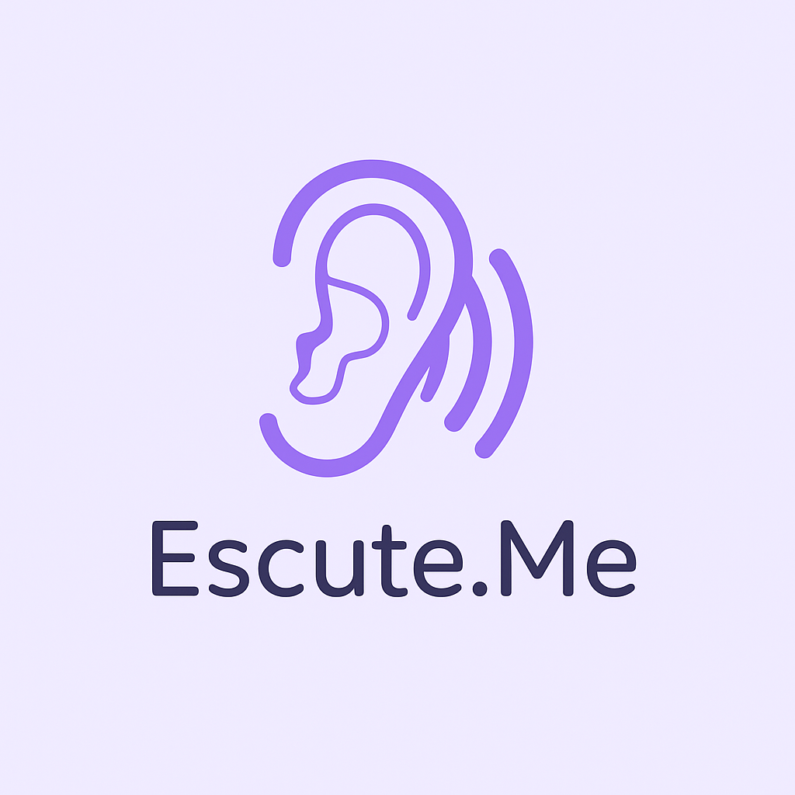

<div align="center">
  
  <h1>Escute.Me</h1>
  <p>💬 Um espaço digital acolhedor para desabafar e receber conforto emocional com a ajuda da inteligência artificial.</p>
</div>

---

## 🌱 Sobre o projeto

O **Escute.Me** é um aplicativo web desenvolvido com o propósito de criar um espaço seguro e empático onde qualquer pessoa possa escrever o que está sentindo e receber uma resposta acolhedora gerada por IA, com linguagem sensível, gentil e reconfortante.

🧠 Ideal para quem precisa colocar pra fora o que está sentindo, mesmo que não tenha com quem conversar no momento.

---

## ✨ Funcionalidades

- Desabafar anonimamente com uma IA acolhedora
- Respostas geradas com empatia e sensibilidade
- Interface leve e minimalista
- Design com foco em bem-estar emocional
- Totalmente gratuito e sem coleta de dados

---

## 🛠️ Tecnologias

- [React](https://reactjs.org/)
- [Vite](https://vitejs.dev/)
- [TypeScript](https://www.typescriptlang.org/)
- [OpenAI API](https://platform.openai.com/)
- [Vercel](https://vercel.com/) (deploy)

---

## 🚀 Como rodar localmente

```bash
# Clone o repositório
git clone https://github.com/seu-usuario/escute-me.git
cd escute-me

# Instale as dependências
npm install

# Crie um arquivo .env na raiz com sua chave da OpenAI
touch .env

# .env
OPENAI_API_KEY=sua-chave-aqui

# Rode o projeto
npm run dev

```
## 🌐 Deploy

A aplicação está disponível em: 🔗 https://escute-me.vercel.app

## 📄 Licença

Este projeto está licenciado sob a **Creative Commons Atribuição-NãoComercial 4.0 Internacional**.  
Leia mais em [creativecommons.org/licenses/by-nc/4.0](https://creativecommons.org/licenses/by-nc/4.0/)


## 🫶 Agradecimento

Criado com coração por João Victor para pessoas que precisam ser ouvidas — mesmo que em silêncio.